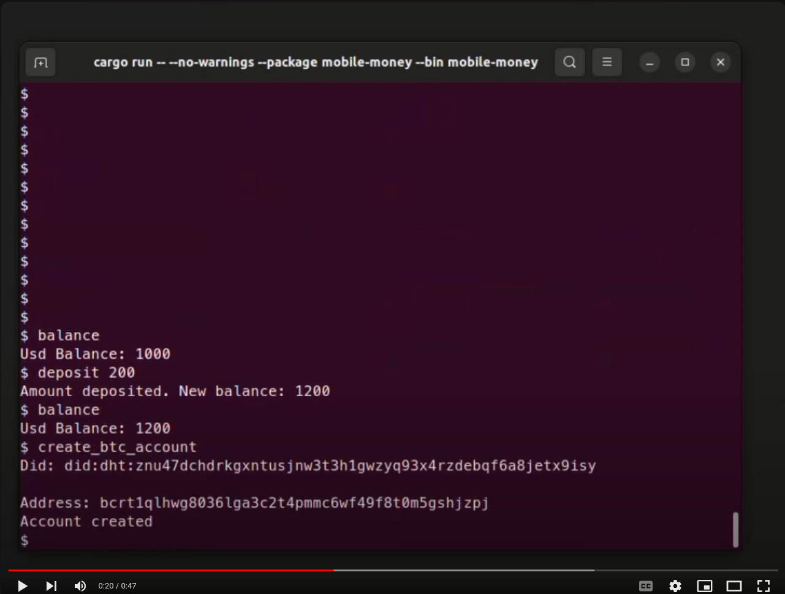

<!-- Improved compatibility of back to top link: See: https://github.com/othneildrew/Best-README-Template/pull/73 -->
<a id="readme-top"></a>


<!-- PROJECT LOGO -->
<br />
<div align="center">
  <a href="/">
    
  </a>

  <h3 align="center">Mobile Money</h3>

  <p align="center">
    A Dummy Mobile Money Cli Appliction exploring Bitcoin-Wasm Light Client and TbDEX
    <br />
     <br />
    This Application is created in partial fulfilment of the Requirement of The 2024 TbDex African Hackathon. 
    <br />
    <a href="https://drive.google.com/file/d/1khb6cEO5vPhXf4IVqJvdeWASrQrHdYT8/view?usp=sharing">View Demo</a>
  </p>
</div>


[](https://youtu.be/M45dhTYDoVk)


<!-- ABOUT THE PROJECT -->
## About The Project

Mobile Money is a dummy Cli mobile money application that uses the Bitcoin-wasm `Node` plugin to provide its users with a non-custodial bitcoin account, allowing them to make cross-border transfers using bitcoin . To provide a seamless experience, the Node plugin makes use of the `TbDex` protocol, which allows for the effective and decentralized conversion of Fiat to Bitcoin and back. The cli application provides the same features as any other mobile money application, including __deposit__, __withdrawal__, and __sending__. It also includes features that are only available through the Node plugin, such as __create_btc_account__, __get_btc_balance__, __get_conversion_offer__ (Tbdx), __convert_amount__ (Tbdx), and __send_btc__..

Mobile money operators are the primary target audience for the Bitcoin-Wasm 'Node' plugin. By demonstrating its intended use with a dummy mobile money application, we hope to demonstrate the benefits that such a plugin can provide its users.  

### Constraint

- The Tbdex Demo currently uses the provided PFI ( 
🏦 Vertex Liquid Assets DID: did:dht:enwguxo8uzqexq14xupe4o9ymxw3nzeb9uug5ijkj9rhfbf1oy5y ). Due to it
been the only PFI that offers the Fiat - BTC .

- The Node plugin currently connects to a RegTest bitcoin node and retrieves its balance through compact block filtering and tracks just a particular bitcoin adddress.

### Tbdex Design Consideration

- __Profitability__: The Node Plugin by itself is open source and open for any mobile money operator to utlize. Upon utilization, such Mobile Money Operator can charge its user per currency conversion , using a percentage or a flat fee depending on financial considerations.

- __Optionality__: Due to the specificity of the Node plugin which deals with the Conversion Of Bitcoin to Fiat and vice versa, Mobile money operators can provides its users the option to choose based on fees and estimated settlement time, these details are provided by the Node plugin.

- __Customer Management__: The Node Plugin doesn't contain sensitive data such as user Bearer Dids and Verifiable Credentials. Rather, the Bitcoin-wasm Signer Software stores all the necessary details and provides Signing Functionalities, which using JSON as the message passing format. Note(The Signer is a work in Progress ). 

- __Customer Satisfaction__: The next iteration of Bitcoin-Wasm `Node` plugin intends to provide a rating mechanism which would provide information regarding the credit worthiness of Known PFIs, which would assist mobile money users to select credit worthy PFIs necessary for Conversion.


<!-- GETTING STARTED -->
## Getting Started

There are necessary steps that needs to be taken to run the demo, such as installing the neecessary requirement for the whole project. Docker needs to be installed which is used to run RegTest Bitcoin node


### Run

Below are the necessary Details needed to run The Application 

1. Install the necessary prerequisites
2. Start the Bitcoin RegTest Node
   ```sh
   ./bitcoin-node.sh
   ```
3. Start The Application
   ```sh
   cargo run --package mobile-money --bin mobile-money 
   ```
4. Input help to the CLI Application to view commands
   ```sh
   $ help
   ```


<p align="right">(<a href="#readme-top">back to top</a>)</p>


